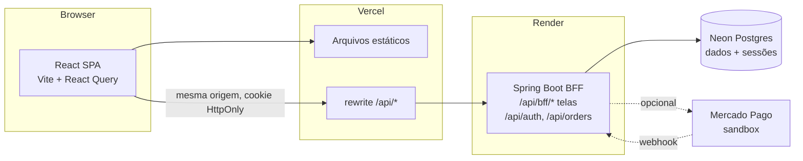

# ☁️ Cloud Market

Marketplace de estudo inspirado em grandes e-commerces brasileiros, construído com **Java 25 + Spring Boot 4** no papel de **BFF (Backend for Frontend)** e **React 19 + TypeScript** no front.

> ⚠️ Projeto de portfólio. **Nenhuma compra é real**: os pagamentos são simulados (simulador interno ou sandbox do Mercado Pago).

**Demo:** `https://cloudmarket.vercel.app` · conta de teste: `demo@cloudmarket.dev` / `senha123`
<sub>(o backend gratuito "dorme" após 15 min sem uso; o primeiro acesso pode levar ~1 min)</sub>

---

## Arquitetura



### Por que BFF?

| Decisão | Motivo |
|---|---|
| **Endpoints por tela** (`/api/bff/home`, `/api/bff/products/{id}`, `/api/bff/search`) | A home ou a página de produto chegam prontas numa única chamada (produto + vendedor + relacionados + parcelamento), sem N requisições do navegador. |
| **Sessão no servidor + cookie HttpOnly** | O navegador nunca guarda token JWT; XSS não consegue roubar credenciais. A sessão fica no Postgres (Spring Session JDBC), então sobrevive ao "sleep" do plano gratuito. |
| **CSRF com cookie `XSRF-TOKEN`** | O axios envia o header `X-XSRF-TOKEN` automaticamente. |
| **Mesma origem** (proxy do Vite / rewrite do Vercel) | Sem CORS e sem problemas com cookies de terceiros. |
| **Pagamento como porta/adaptador** (`PaymentGateway`) | Troca-se `fake` ↔ `mercadopago` por variável de ambiente, sem mexer em pedidos nem no front. |
| **Preço sempre recalculado no servidor** | O carrinho do navegador serve só para exibição; o pedido usa o preço do banco. |

### Estrutura

```
CloudMarket/
├── cloudmarketBackend/                 # Spring Boot (BFF)
│   ├── src/main/java/com/cloudmarket/
│   │   ├── bff/          # controllers e view-models por tela (a "cara" do BFF)
│   │   ├── auth/         # login/cadastro por sessão, principal, CSRF
│   │   ├── catalog/      # produtos e categorias (domínio)
│   │   ├── order/        # pedidos (domínio)
│   │   ├── payment/      # PaymentGateway + adaptadores fake/ e mercadopago/
│   │   ├── user/         # usuários + usuário demo
│   │   ├── config/       # segurança, propriedades
│   │   └── common/       # erros (Problem Details), paginação
│   ├── src/main/resources/db/migration/  # Flyway: schema + dados de exemplo
│   └── Dockerfile
├── cloudmarketFrontend/                # React + Vite + TS + Tailwind
│   ├── src/api/          # axios + endpoints do BFF
│   ├── src/pages/        # Home, Busca, Produto, Carrinho, Checkout, Pedidos, Login...
│   ├── src/components/
│   ├── src/hooks/        # useAuth, useCheckout
│   ├── src/store/        # carrinho (zustand + localStorage)
│   └── vercel.json       # rewrite /api -> Render
├── docker-compose.yml    # Postgres local
└── render.yaml           # deploy do backend (Blueprint)
```

### Endpoints

| Método | Rota | Auth | Descrição |
|---|---|---|---|
| GET | `/api/bff/home` | – | Categorias + ofertas + mais vendidos + frete grátis |
| GET | `/api/bff/search?q=&category=&sort=&page=` | – | Busca paginada + filtros |
| GET | `/api/bff/products/{id}` | – | Página de produto completa |
| GET | `/api/auth/csrf` · `/api/auth/me` | – | Cookie CSRF · usuário logado (204 se visitante) |
| POST | `/api/auth/register` · `/api/auth/login` · `/api/auth/logout` | – | Sessão |
| POST | `/api/orders` | ✔ | Cria pedido a partir do carrinho |
| GET | `/api/orders` · `/api/orders/{id}` | ✔ | Minhas compras |
| POST | `/api/orders/{id}/checkout` | ✔ | Inicia pagamento e devolve `redirectUrl` |
| POST | `/api/payments/fake/{orderId}/confirm` | ✔ | Simulador (provider `fake`) |
| POST | `/api/payments/webhooks/mercadopago` | – | Webhook (provider `mercadopago`) |

---

## Rodando localmente

Pré-requisitos: **JDK 25**, **Node 20+** e **Docker** (só para o Postgres).

```bash
# 1. banco
docker compose up -d

# 2. backend (http://localhost:8080) - o Flyway cria tabelas e dados de exemplo
cd cloudmarketBackend
./mvnw spring-boot:run          # Windows: mvnw.cmd spring-boot:run

# 3. frontend (http://localhost:5173) - em outro terminal
cd cloudmarketFrontend
npm install
npm run dev
```

Entre com `demo@cloudmarket.dev` / `senha123`, adicione produtos ao carrinho e finalize a compra.

### Pagamentos simulados

**Provider `fake` (padrão)**: não precisa de conta. Na tela de checkout simulado:

| Cartão | Resultado |
|---|---|
| `4111 1111 1111 1111` | aprovado |
| `4000 0000 0000 0002` | recusado |

**Provider `mercadopago` (sandbox, opcional)**: mostra integração com um gateway real sem cobrar nada.
1. Crie uma conta em <https://www.mercadopago.com.br/developers> → *Suas integrações* → *Criar aplicação* (Checkout Pro).
2. Em *Contas de teste*, crie um **vendedor** e um **comprador** de teste.
3. Logado como o vendedor de teste, copie o **Access Token de teste** (começa com `TEST-` ou é da conta de teste).
4. Configure `PAYMENT_PROVIDER=mercadopago` e `MERCADOPAGO_ACCESS_TOKEN=...`.
5. No checkout, entre com o **comprador de teste** e use um dos cartões de teste da documentação do Mercado Pago (nome do titular `APRO` = aprovado, `OTHE` = recusado).

> O webhook só funciona com o backend publicado em HTTPS (Render). Localmente, use o provider `fake`.

---

## Deploy gratuito (passo a passo)

| Peça | Serviço | Plano gratuito |
|---|---|---|
| Banco | [Neon](https://neon.tech) | 0,5 GB, não expira; "hiberna" quando ocioso |
| Backend | [Render](https://render.com) | 512 MB, dorme após 15 min sem tráfego, ~1 min para acordar |
| Frontend | [Vercel](https://vercel.com) | Hobby, CDN global |

> Evite o Postgres gratuito do Render: ele **expira em 30 dias**. O Supabase também serve, mas pausa o projeto após ~1 semana sem uso.

### 1. Banco no Neon
1. Crie um projeto (região `AWS São Paulo` se disponível).
2. Em *Connection Details*, pegue host, usuário e senha e monte a URL **JDBC**:
   `jdbc:postgresql://<host>/neondb?sslmode=require`

### 2. Backend no Render
1. Suba este repositório no GitHub.
2. Render → **New → Blueprint** → selecione o repositório (usa o `render.yaml`).
3. Preencha as variáveis: `DATABASE_URL`, `DATABASE_USERNAME`, `DATABASE_PASSWORD`,
   `FRONTEND_URL` (URL do Vercel) e `BACKEND_URL` (URL do próprio serviço no Render).
4. Aguarde o build; teste `https://<seu-servico>.onrender.com/actuator/health`.

### 3. Frontend no Vercel
1. Em `cloudmarketFrontend/vercel.json`, troque `cloudmarket-bff.onrender.com` pela URL do seu serviço.
2. Vercel → **Add New Project** → importe o repositório → **Root Directory: `cloudmarketFrontend`** (framework Vite é detectado).
3. Deploy. Todas as chamadas `/api/*` são repassadas ao Render pela mesma origem, então o cookie de sessão funciona.

### Dica: evitar o "cold start" na hora da entrevista
Abra o site ~1 minuto antes de mostrar, ou configure um monitor gratuito (ex.: UptimeRobot) chamando `/actuator/health` a cada 10–14 min em horário comercial. Um único serviço ligado 24/7 cabe nas 750 h/mês do Render.

---

## Variáveis de ambiente (backend)

| Variável | Padrão | Descrição |
|---|---|---|
| `DATABASE_URL` | `jdbc:postgresql://localhost:5432/cloudmarket` | URL JDBC |
| `DATABASE_USERNAME` / `DATABASE_PASSWORD` | `cloudmarket` | Credenciais |
| `FRONTEND_URL` | `http://localhost:5173` | Usada nos redirects de pagamento |
| `BACKEND_URL` | `http://localhost:8080` | Usada no webhook |
| `PAYMENT_PROVIDER` | `fake` | `fake` ou `mercadopago` |
| `MERCADOPAGO_ACCESS_TOKEN` | – | Só credencial de **teste** |
| `DEMO_USER_ENABLED` | `true` | Cria `demo@cloudmarket.dev` |
| `SPRING_PROFILES_ACTIVE` | `dev` | Use `prod` no Render |

---

## Próximos passos (roadmap)

- [ ] Área do vendedor: cadastrar/editar anúncios com upload de imagem (Cloudinary free)
- [ ] Perguntas e respostas no anúncio + avaliações
- [ ] Favoritos e histórico de navegação
- [ ] Busca full-text com `tsvector` do Postgres
- [ ] Testes de integração com Testcontainers + GitHub Actions (CI)
- [ ] Documentação OpenAPI (springdoc)
- [ ] Observabilidade: logs estruturados + métricas do Actuator
